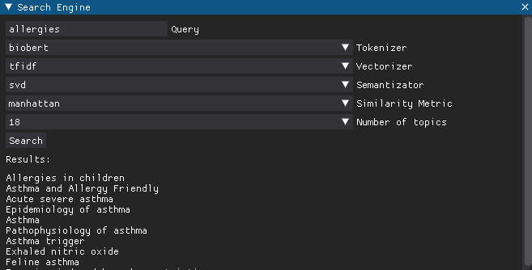

# semantic-search
Semantic search engine with a database based on Wikipedia

### Tested methods
- Tokenization: treebank, casual tokenizer, biobert, punkt.
- Vectorization: bag of words, tf-idf.
- Semantization: PCA, LDiA, SVD.
- Distance/similarity metrics: euclidean distance, cosine similarity, chebyshev distance, manhattan distance.

### Tools/libraries
- nltk (tokenization),
- transformers (tokenization),
- sklearn (vectorization, semantization and vector similarity metrics),
- pandas, numpy, matplotlib, pymongo, dearpygui.   

### GUI

### Create environment
- Conda  
`conda env create -n semantic-search --file semantic-search.yml`
  
- Virtual env  
  - Unix/macOS:  
  `python3 -m venv .venv`  
  `source .venv/bin/activate`  
  `python3 -m pip install -r requirements.txt`
  - Windows:  
  `py -m venv .venv`  
  `.venv\bin\Activate.bat`  
  `py -m pip install -r requirements.txt`
